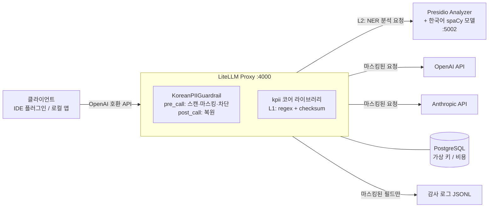

# LLM PII Gateway 설계 문서

> 개인 연구 프로젝트. LiteLLM Proxy 기반, 한국어 개인정보(PII) 필터링 게이트웨이.
> 목표: LLM 게이트웨이에서 한국어 PII를 탐지·가역 마스킹·스트리밍 복원하는 파이프라인을 직접 설계·구현하며 검증한다.
> 이 문서는 구현자(AI 포함)가 Phase 0부터 순서대로 구현할 수 있도록 작성되었다.
> **구현자는 시작 전에 반드시 [§9 구현 규칙](#9-구현-규칙-구현자-필독)을 먼저 읽을 것.**

---

## 1. 개요

### 1.1 목적

LLM 게이트웨이를 하나 세우고, 그 게이트웨이를 통과하는 요청 본문의 개인정보를 **탐지 → 마스킹/차단**하여 원문 PII가 외부 LLM API(OpenAI, Anthropic 등)로 유출되지 않게 한다. 한국어 PII 탐지 품질과 가역 마스킹·스트리밍 복원 파이프라인을 직접 만들어 검증하는 것이 이 연구의 핵심이다.

### 1.2 성공 기준

1. 클라이언트는 **base URL과 API 키만 변경**하면 기존 코드 수정 없이 사용 가능 (OpenAI 호환 API).
2. 정형 PII(주민등록번호, 카드번호, 전화번호 등)는 게이트웨이를 통과할 때 **탐지 가능 범위 내 유출 0건**.
3. 마스킹된 요청에 대한 응답은 클라이언트에게 **원문이 복원된 형태**로 전달 (가역 마스킹).
4. NER 미사용 시 게이트웨이 추가 지연 p95 < 30ms, NER 사용 시 p95 < 350ms.
5. 감사 로그·게이트웨이 로그 어디에도 **PII 원문이 남지 않는다** (테스트로 강제).

### 1.3 부수 효과 (이 설계로 함께 얻는 것)

- API 키 중앙 관리 (용도별 가상 키 발급, LiteLLM 기본 기능)
- 용도별 비용 추적·예산·레이트리밋 (LiteLLM 기본 기능)
- 전 LLM 호출에 대한 감사 로그

### 1.4 용어

| 용어 | 의미 |
|---|---|
| L1 탐지 | 정규식 + 체크섬 기반 결정론적 탐지 (인프로세스, 항상 동작) |
| L2 탐지 | Presidio + 한국어 NER 기반 탐지 (사이드카, 이름/주소 담당) |
| 가역 마스킹 | 원문을 플레이스홀더로 치환해 업스트림에 보내고, 응답에서 되돌리는 방식 |
| 매핑 | `{플레이스홀더: 원문}` 딕셔너리. 요청 수명 동안만 메모리에 존재 |

---

## 2. 전체 아키텍처



### 요청 처리 흐름

```
1. 클라이언트 → POST /v1/chat/completions (원문 PII 포함 가능)
2. [pre_call hook]
   a. messages 전체(system/user/assistant/tool + multimodal text part + tool_calls args)에서 텍스트 추출
   b. L1 탐지 (regex+checksum) — 항상
   c. L2 탐지 (Presidio NER) — Phase 4부터, 활성화 시
   d. 스팬 병합 → 정책 적용:
      - BLOCK 엔티티 존재 → HTTP 400 반환, 요청 종료
      - MASK 엔티티 → 플레이스홀더 치환, 매핑을 요청 컨텍스트에 저장
      - LOG_ONLY → 탐지 기록만
3. 마스킹된 요청 → 업스트림 LLM
4. [post_call hook / streaming iterator hook]
   응답 텍스트에서 플레이스홀더를 매핑으로 원문 복원
5. 복원된 응답 → 클라이언트
6. 감사 이벤트 기록 (원문 없이 엔티티 타입/개수/액션만)
```

---

## 3. 핵심 설계 결정 (ADR 요약)

| # | 결정 | 이유 |
|---|---|---|
| D1 | **LiteLLM Proxy 채택** | OpenAI 호환 게이트웨이 사실상 표준. 키 관리·비용 추적·멀티 프로바이더 라우팅이 내장. 커스텀 guardrail 훅으로 PII 필터를 끼울 수 있음. **버전은 특정 stable 태그로 고정**한다 |
| D2 | **탐지 2계층 (L1 항상 + L2 선택)** | 정형 PII는 정규식+체크섬이 빠르고 정확(수 ms). 이름/주소는 NER 필요하지만 무겁고 장애 지점이 됨 → 분리해서 L2가 죽어도 L1은 동작 |
| D3 | **가역 마스킹 기본, 차단은 최소** | 차단은 UX를 해쳐 우회 유인을 만든다. 주민등록번호·크리덴셜 등 최고 위험만 BLOCK, 나머지는 MASK 후 응답에서 복원 |
| D4 | **매핑은 요청 스코프 인메모리만** | 매핑에는 PII 원문이 들어있다. Redis/DB/파일에 절대 저장하지 않고, 로그에도 남기지 않는다. 요청 처리가 끝나면 소멸 |
| D5 | **실패 정책 분리**: guardrail 내부 오류 = fail-closed(차단), Presidio 장애 = degrade(L1만으로 진행) | 필터 자체가 깨졌는데 요청을 통과시키면 게이트웨이의 존재 이유가 없다. 반면 L2만 죽은 경우는 L1이 커버하므로 가용성 우선. 둘 다 정책 파일로 변경 가능 |
| D6 | **스트리밍 복원은 슬라이딩 버퍼** | 플레이스홀더가 청크 경계에 걸릴 수 있으므로 `[` 이후를 보류하는 최소 버퍼링으로 해결 (§5.3) |
| D7 | **로그에는 마스킹된 형태/통계만** | 감사 로그가 PII 저장소가 되는 역설 방지. "원문 무유출"을 테스트로 강제 |
| D8 | **kpii 코어는 LiteLLM 무의존 순수 파이썬** | 탐지/마스킹 로직을 단위테스트 가능하게 분리. LiteLLM 버전업/교체 시 어댑터만 수정 |

---

## 4. PII 엔티티 카탈로그 & 기본 정책

### 4.1 엔티티 정의

| 엔티티 키 | 대상 | 탐지 | 검증 | 기본 액션 | Phase |
|---|---|---|---|---|---|
| `RRN` | 주민등록번호·외국인등록번호 | regex | 생년월일 유효성 + 체크섬(부록 A.1)¹ | **BLOCK** | 1 |
| `CARD` | 신용/체크카드 번호 | regex | **Luhn 필수**(부록 A.2) | MASK | 1 |
| `PHONE` | 휴대폰·유선 전화번호 | regex | 국번 유효성 | MASK | 1 |
| `EMAIL` | 이메일 주소 | regex | — | MASK | 1 |
| `DRIVER_LICENSE` | 운전면허번호 | regex | 지역코드 유효성 | MASK | 1 |
| `PASSPORT` | 여권번호 | regex + **문맥 필수**² | — | MASK | 1 |
| `BANK_ACCOUNT` | 계좌번호 | regex + **문맥 필수**² | — | MASK | 1 |
| `BRN` | 사업자등록번호 | regex | 체크섬(부록 A.3) | LOG_ONLY³ | 1 |
| `CREDENTIAL` | API 키·토큰·개인키 (sk-, AKIA, ghp_ 등) | regex | — | **BLOCK** | 1 |
| `PERSON` | 사람 이름 | NER (Presidio) | — | MASK | 4 |
| `LOCATION` | 주소·지명 | NER (Presidio) | — | MASK | 4 |

- ¹ 2020년 10월 이후 발급된 주민등록번호는 뒷자리가 임의번호라 체크섬이 적용되지 않는다. 따라서 **형식+생년월일이 유효하면 탐지 확정**, 체크섬 통과는 신뢰도만 올린다 (탐지 여부를 체크섬에 의존하지 말 것).
- ² 오탐률이 높은 패턴은 주변 ±30자 내 문맥 키워드가 있을 때만 탐지 확정. `PASSPORT`: (여권, passport), `BANK_ACCOUNT`: (계좌, 입금, 이체, 송금, 은행명: 국민/신한/우리/하나/농협/기업/카카오뱅크/토스/케이뱅크/새마을/우체국).
- ³ 사업자등록번호는 업무 문맥에서 정상적으로 오가는 경우가 많아 기본은 기록만. 정책 파일로 MASK 전환 가능.

### 4.2 액션 의미

| 액션 | 동작 |
|---|---|
| `BLOCK` | 요청 전체를 HTTP 400으로 거부. 업스트림 호출 없음. 응답 스펙은 §5.4 |
| `MASK` | 플레이스홀더로 치환 후 진행. 응답에서 복원 |
| `LOG_ONLY` | 원문 그대로 통과. 감사 이벤트에 탐지 사실만 기록 |
| `OFF` | 해당 엔티티 탐지 비활성화 |

### 4.3 정책 파일 (`policies/default.yaml`)

```yaml
version: 1
default_action: mask          # 카탈로그에 없는/새 엔티티의 기본값
entities:
  RRN:            { action: block }
  CARD:           { action: mask }
  PHONE:          { action: mask }
  EMAIL:          { action: mask }
  DRIVER_LICENSE: { action: mask }
  PASSPORT:       { action: mask }
  BANK_ACCOUNT:   { action: mask }
  BRN:            { action: log_only }
  CREDENTIAL:     { action: block }
  PERSON:         { action: mask }      # ner.enabled=true일 때만 유효
  LOCATION:       { action: mask }
on_internal_error: block      # guardrail 내부 예외 시: block(기본) | allow
ner:
  enabled: false              # Phase 4에서 true로
  api_base: http://presidio-analyzer:3000
  timeout_ms: 300
  on_failure: degrade         # degrade(L1만으로 진행+경고) | block
```

---

## 5. 마스킹/복원 스펙

### 5.1 플레이스홀더 형식

```
[<ENTITY>_<n>]     예: [PHONE_1], [PERSON_2], [CARD_1]
```

- `n`은 요청 내 해당 엔티티 타입의 **최초 등장 순서** (1부터).
- **동일 원문 값은 요청 내에서 항상 동일 플레이스홀더**를 받는다 (대화 일관성 유지).
- 형식 정규식: `\[(?:RRN|CARD|PHONE|EMAIL|DRIVER_LICENSE|PASSPORT|BANK_ACCOUNT|BRN|CREDENTIAL|PERSON|LOCATION)_\d{1,3}\]` — 최대 길이 상수 `MAX_PLACEHOLDER_LEN`으로 관리 (현재 카탈로그 기준 21자, 여유 있게 24).
- 입력 텍스트에 우연히 같은 형식의 문자열이 원래 존재하는 경우: 복원 시 매핑에 없는 플레이스홀더는 그대로 둔다 (오동작 없음).

### 5.2 매핑 수명주기 (보안 핵심)

```
생성: pre_call에서 마스킹할 때 {placeholder: 원문} 생성
저장: data["metadata"]["kpii_mapping"] (LiteLLM 요청 객체 내부)
사용: post_call_success_hook / streaming_iterator_hook에서 복원에만 사용
소멸: 요청 처리 종료와 함께 GC
금지: Redis·DB·파일·로그·예외 메시지·메트릭 라벨에 절대 포함 금지
```

멀티턴 대화 주의사항: 클라이언트는 매 요청마다 전체 히스토리를 다시 보내므로, 이전 턴에서 복원돼 돌아간 원문이 다음 요청에 다시 들어온다. **매 요청 독립적으로 다시 마스킹**하면 되므로 요청 간 매핑 공유는 불필요하다 (stateless).

### 5.3 스트리밍 복원 알고리즘 (Phase 3)

문제: `[PHONE_1]`이 SSE 청크 경계에서 `[PHO` / `NE_1]`로 쪼개질 수 있다.

```
상태: buffer = ""   (요청당 하나)

각 청크의 delta text에 대해:
  buffer += text
  out = ""
  while True:
      i = buffer.find('[')
      if i == -1:                       # '[' 없음 → 전부 안전
          out += buffer; buffer = ""; break
      out += buffer[:i]; buffer = buffer[i:]
      m = PLACEHOLDER_RE.match(buffer)  # 완성형 매치 시도
      if m:                             # 완성된 플레이스홀더
          token = m.group(0)
          out += mapping.get(token, token)
          buffer = buffer[len(token):]
          continue
      if is_potential_prefix(buffer) and len(buffer) <= MAX_PLACEHOLDER_LEN:
          break                         # 미완성 가능성 → 보류하고 다음 청크 대기
      out += buffer[0]; buffer = buffer[1:]   # 플레이스홀더 아님 → '[' 하나 방출
  청크의 delta text를 out으로 교체해 yield (out이 ""이면 해당 청크는 skip 가능)

스트림 종료 시: buffer에 남은 것 전부 방출 (완성형 토큰은 치환 후)
```

- `is_potential_prefix(s)`: `s`가 `PLACEHOLDER_RE`의 접두어가 될 수 있는지 (예: `"["`, `"[PHO"`, `"[PHONE_1"` → true / `"[안녕"` → false).
- delta text 외의 청크 필드(role, finish_reason, usage 등)는 그대로 통과.
- 최대 지연은 플레이스홀더 1개 길이만큼의 문자 보류 — 체감 불가 수준.

### 5.4 BLOCK 응답 스펙

OpenAI 호환 에러 형식을 유지해 클라이언트 SDK가 정상 파싱하게 한다. **에러 메시지에 원문 값 포함 금지** — 엔티티 타입명만.

```
HTTP 400
{
  "error": {
    "message": "요청에 차단 대상 민감정보가 포함되어 있습니다: RRN(주민등록번호). 해당 값을 제거한 뒤 다시 시도하세요.",
    "type": "invalid_request_error",
    "param": null,
    "code": "pii_blocked"
  }
}
```

### 5.5 스캔 범위 (v1)

| 대상 | 스캔 필드 |
|---|---|
| `/v1/chat/completions` | `messages[].content` (문자열 또는 multimodal 배열의 `text` part), `messages[].tool_calls[].function.arguments`, tool 롤 메시지의 `content` |
| `/v1/completions` | `prompt` |
| `/v1/embeddings` | `input` (문자열 또는 문자열 배열) — 마스킹만, 복원 불필요 |
| 제외 (v1) | 이미지(base64/URL), 파일 첨부, 오디오 → §10 비범위. 이미지 part는 그대로 통과시키되 감사 이벤트에 `image_passthrough: true` 기록 |

---

## 6. 컴포넌트 설계

### 6.1 저장소 구조

```
llm-pii-gateway/
├── DESIGN.md                        # 이 문서
├── README.md                        # 실행법 (Phase마다 갱신)
├── Dockerfile                       # LiteLLM 베이스 + kpii/guardrail 포함
├── docker-compose.yml               # litellm + postgres (+ presidio: P4)
├── docker-compose.test.yml          # + fake-upstream
├── .env.example
├── Makefile
├── litellm/
│   └── config.yaml                  # LiteLLM 프록시 설정 (guardrails 포함)
├── custom_guardrails/               # LiteLLM 어댑터 (레포 루트 — 도커 /app 와 동일 import 경로)
│   ├── __init__.py
│   └── kpii_guardrail.py            # KoreanPIIGuardrail (Phase 2~3)
├── kpii/                            # 코어 라이브러리 — LiteLLM 무의존
│   ├── __init__.py
│   ├── types.py                     # Span, Detection, Action 등 dataclass
│   ├── validators.py                # luhn / rrn / brn 체크섬 (부록 A)
│   ├── detectors/
│   │   ├── __init__.py
│   │   ├── regex_detectors.py       # L1 (부록 B의 초안에서 시작)
│   │   └── presidio_client.py       # L2 HTTP 클라이언트 (Phase 4)
│   ├── engine.py                    # scan() / mask() / restore() 통합 진입점
│   ├── masking.py                   # 플레이스홀더 발급·치환·복원, 스트림 버퍼
│   ├── policy.py                    # 정책 yaml 로더/검증
│   ├── openai_gateway.py            # OpenAI 요청 본문 스캔/마스킹/차단 (Phase 2, §5.5)
│   └── audit.py                     # 감사 이벤트 dataclass + 로거 (Phase 5)
├── policies/
│   └── default.yaml
├── presidio/                        # Phase 4
│   ├── Dockerfile
│   ├── nlp_conf.yaml
│   └── recognizers.yaml
├── tests/
│   ├── unit/                        # 네트워크 불필요
│   ├── integration/                 # docker compose 필요 (pytest -m integration)
│   ├── fixtures/
│   │   └── korean_pii_corpus.jsonl  # 합성 데이터만!
│   └── fake_upstream/
│       └── app.py                   # OpenAI 호환 가짜 서버 (Phase 2)
└── docs/
    ├── NOTES.md                     # LiteLLM 버전 확인 사항 기록
    ├── onboarding.md                # 사용법 안내 (Phase 5)
    └── operations.md                # 운영 가이드 (Phase 5)
```

### 6.2 kpii 코어 인터페이스

```python
# kpii/types.py
@dataclass(frozen=True)
class Detection:
    entity: str          # "PHONE" 등
    start: int
    end: int
    value: str           # 원문 — 이 객체를 로그에 통째로 찍지 말 것 (repr에서 value 제외)
    confidence: float    # L1 체크섬 통과=1.0, 형식만=0.8, NER=모델 점수
    source: str          # "regex" | "ner"

# kpii/engine.py
def scan(text: str, policy: Policy) -> list[Detection]: ...
class MaskingSession:            # 요청당 1개 — 카운터/매핑 보유
    def mask(self, text: str, detections: list[Detection]) -> str: ...
    def restore(self, text: str) -> str: ...
    def stream_restorer(self) -> StreamRestorer: ...   # §5.3 구현체
    @property
    def mapping(self) -> dict[str, str]: ...
```

스팬 병합 규칙 (L1+L2 결과 합칠 때): 시작 위치 정렬 → 겹치는 스팬은 (1) 더 긴 것 우선, (2) 길이 같으면 L1(regex) 우선.

### 6.3 LiteLLM guardrail 어댑터 스켈레톤

> ⚠️ 아래 시그니처는 참고용이다. **고정한 LiteLLM 버전의 실제 소스**(`litellm/integrations/custom_guardrail.py`)에서 확인 후 구현할 것 (§9 규칙 1).

```python
from typing import Optional, Union
from fastapi import HTTPException
from litellm.integrations.custom_guardrail import CustomGuardrail
from litellm.proxy._types import UserAPIKeyAuth
from litellm.caching.caching import DualCache

from kpii.engine import scan, MaskingSession
from kpii.policy import Policy


class KoreanPIIGuardrail(CustomGuardrail):
    def __init__(self, policy_path: Optional[str] = None, **kwargs):
        self.policy = Policy.load(policy_path or "/app/policies/default.yaml")
        super().__init__(**kwargs)

    async def async_pre_call_hook(
        self, user_api_key_dict: UserAPIKeyAuth, cache: DualCache,
        data: dict, call_type: str,
    ) -> Union[Exception, str, dict, None]:
        try:
            session = MaskingSession()
            # §5.5의 스캔 대상 필드 순회 → scan → BLOCK 검사 → mask
            # BLOCK: raise HTTPException(status_code=400, detail={...§5.4})
            data.setdefault("metadata", {})["kpii_mapping"] = session.mapping
            return data
        except HTTPException:
            raise
        except Exception:
            if self.policy.on_internal_error == "block":
                raise HTTPException(status_code=400, detail={...})  # fail-closed
            return data

    async def async_post_call_success_hook(self, data, user_api_key_dict, response):
        # Phase 3: data["metadata"]["kpii_mapping"] 으로 response 텍스트 복원
        return response

    async def async_post_call_streaming_iterator_hook(
        self, user_api_key_dict, response, request_data: dict,
    ):
        # Phase 3: request_data["metadata"]["kpii_mapping"] + StreamRestorer
        async for chunk in response:
            yield chunk
```

매핑 전달 검증 포인트: `data["metadata"]`가 post/streaming 훅까지 유지되는지 고정 버전에서 확인. 안 되면 폴백으로 `litellm_call_id` 키 모듈-레벨 dict(+TTL 정리)를 쓰되, 그 사실을 `docs/NOTES.md`에 기록.

### 6.4 LiteLLM 설정 (`litellm/config.yaml`)

```yaml
model_list:
  - model_name: claude-opus-4-8            # 게이트웨이가 노출할 이름
    litellm_params:
      model: anthropic/claude-opus-4-8
      api_key: os.environ/ANTHROPIC_API_KEY
  - model_name: claude-sonnet-5
    litellm_params:
      model: anthropic/claude-sonnet-5
      api_key: os.environ/ANTHROPIC_API_KEY
  - model_name: gpt-4o                      # 예시 — 실제 사용할 모델로 교체
    litellm_params:
      model: openai/gpt-4o
      api_key: os.environ/OPENAI_API_KEY
  - model_name: mock-model                  # 통합테스트 전용 (fake upstream 라우팅)
    litellm_params:
      model: openai/mock-model
      api_key: "fake-key"
      api_base: http://fake-upstream:9000/v1

litellm_settings:
  drop_params: true
  turn_off_message_logging: true            # 콜백에 메시지 원문 전달 금지

general_settings:
  master_key: os.environ/LITELLM_MASTER_KEY
  database_url: os.environ/DATABASE_URL
  store_prompts_in_spend_logs: false        # spend 로그에 프롬프트 저장 금지

guardrails:
  - guardrail_name: kpii
    litellm_params:
      guardrail: custom_guardrails.kpii_guardrail.KoreanPIIGuardrail
      mode: "pre_call"                      # post 훅 활성화 방식은 고정 버전 문서 확인
      default_on: true
      policy_path: /app/policies/default.yaml
```

> `default_on: true` — 모든 요청에 강제 적용. 요청별 guardrail 해제가 가능한 설정이 있는지 고정 버전에서 확인하고, **가능하다면 반드시 비활성화**(사용자가 스스로 필터를 끌 수 있으면 안 됨).

### 6.5 Dockerfile

```dockerfile
FROM ghcr.io/berriai/litellm:vX.Y.Z-stable   # Phase 0에서 최신 stable 확인 후 고정
COPY kpii /app/kpii
COPY litellm/custom_guardrails /app/custom_guardrails
COPY policies /app/policies
ENV PYTHONPATH="/app:${PYTHONPATH}"
# kpii 추가 의존성(httpx 등)이 생기면 여기서 pip install
```

### 6.6 Presidio 사이드카 (Phase 4)

- **analyzer만 사용** (anonymizer 불필요 — 마스킹은 우리 엔진이 함). REST: `POST /analyze` `{text, language: "ko"}` → 스팬 목록.
- 커스텀 이미지: 공식 presidio-analyzer 베이스에 spaCy 한국어 모델(`ko_core_news_lg`) 설치, NLP 설정에서 `ko` 등록.
- **라벨 매핑 필수**: 한국어 spaCy 모델의 NER 라벨셋(예: `PS`, `LC`, `OG` 계열)을 확인하고 Presidio 설정에서 `PS→PERSON`, `LC→LOCATION`으로 매핑. 라벨셋은 모델 문서/`nlp.pipe_labels`로 확인해 `docs/NOTES.md`에 기록.
- 게이트웨이 쪽 클라이언트(`kpii/detectors/presidio_client.py`): httpx, 타임아웃 `ner.timeout_ms`, 실패 시 정책의 `ner.on_failure` 적용 (기본 degrade: L1 결과만으로 진행 + 경고 로그 + 메트릭 카운터).

---

## 7. 감사 로그 & 메트릭 스펙 (Phase 5)

### 7.1 감사 이벤트 (JSONL, stdout 또는 파일)

```json
{
  "ts": "2026-07-22T10:00:00+09:00",
  "request_id": "...",
  "key_alias": "team-commerce",
  "model": "claude-sonnet-5",
  "endpoint": "/v1/chat/completions",
  "stream": true,
  "detections": {"PHONE": 2, "EMAIL": 1},
  "actions": {"masked": 3, "blocked": 0, "log_only": 0},
  "blocked": false,
  "ner_used": true,
  "ner_degraded": false,
  "image_passthrough": false,
  "scan_latency_ms": 4.2
}
```

**금지 필드: 원문 값, 마스킹 전 텍스트, 매핑.** 탐지 위치(start/end)도 넣지 않는다(원문 추정 단서가 됨).

### 7.2 메트릭 (Prometheus)

LiteLLM 내장 Prometheus 콜백은 enterprise 기능일 수 있으므로 **guardrail에서 직접 `prometheus_client`로 노출** (사이드 포트 또는 LiteLLM 앱에 마운트 가능한지 확인):

- `kpii_detections_total{entity, action}` (counter)
- `kpii_blocked_requests_total` (counter)
- `kpii_scan_latency_seconds` (histogram)
- `kpii_ner_failures_total` (counter)

---

## 8. Phase 계획

> 각 Phase는 독립적으로 완료 가능한 PR 단위다. **DoD(완료 기준)를 전부 통과하기 전에 다음 Phase로 넘어가지 말 것.**

---

### Phase 0 — 스캐폴딩 & LiteLLM 프록시 기동

**목표**: PII 필터 없이, LiteLLM 프록시가 도커로 떠서 가상 키로 업스트림 호출이 되는 상태.

**작업**:
1. §6.1 저장소 구조 생성 (빈 패키지 포함), `pyproject.toml`(kpii, python 3.11+, pytest, ruff), `.env.example`, `.gitignore`.
2. LiteLLM 최신 stable 버전 확인 → Dockerfile 태그 고정, `docs/NOTES.md`에 버전과 확인 날짜 기록.
3. `litellm/config.yaml` 작성 (§6.4에서 guardrails 섹션은 아직 제외).
4. `docker-compose.yml`: `litellm`(build), `postgres:16`. 헬스체크 포함.
5. `Makefile`: `up`, `down`, `build`, `logs`, `smoke`, `test-unit`, `test-integration`.
6. README: 로컬 실행법.

**DoD**:
- [ ] `make up` 후 `curl http://localhost:4000/health/liveliness` 정상.
- [ ] master key로 가상 키 발급(`POST /key/generate`) 성공.
- [ ] (업스트림 키 있으면) 발급 키로 `/v1/chat/completions` 1회 성공. 키 없으면 mock-model 라우팅은 Phase 2에서 검증하는 것으로 넘어가되 프록시 기동까지는 확인.

**제외**: guardrail, kpii, 테스트 인프라.

---

### Phase 1 — kpii 코어 라이브러리 (L1 탐지 + 마스킹 엔진)

**목표**: LiteLLM 없이 단독으로 동작·테스트되는 탐지/마스킹 라이브러리.

**작업**:
1. `types.py`, `validators.py`(부록 A 알고리즘 그대로), `detectors/regex_detectors.py`(부록 B 초안에서 시작해 테스트로 다듬기), `policy.py`, `masking.py`(MaskingSession + StreamRestorer §5.3), `engine.py`.
2. `Detection.__repr__`에서 `value` 마스킹 처리 (실수 로그 방지).
3. 픽스처 코퍼스 `tests/fixtures/korean_pii_corpus.jsonl` 작성 — **전부 합성 데이터**:
   - 엔티티별 양성 케이스 3개 이상 (구분자 변형: 하이픈/공백/없음 포함)
   - **음성(오탐 유도) 케이스**: 주문번호 13자리, 날짜(20260722), 운송장 번호, 금액, 버전 문자열, Luhn 실패 16자리, 문맥 없는 계좌 형태 숫자, 체크섬 실패 사업자번호 등 10개 이상
   - 멀티 엔티티 혼합 문장, 동일 값 반복 문장
   - 유효 체크섬 샘플은 생성 유틸(`tests/util/gen.py`)로 합성 (실존 번호 사용 금지)
4. 단위 테스트: 탐지 정확성(픽스처 전건), 마스킹→복원 왕복 무손실, 동일값-동일플레이스홀더, 스팬 병합, StreamRestorer(청크 경계 분할 케이스 — 플레이스홀더를 1~3글자 단위로 쪼개 밀어넣는 테스트 포함), 정책 로더 검증.
5. 성능 스모크: 10,000자 텍스트 L1 스캔 < 5ms (단순 assert, 엄격할 필요 없음).

**DoD**:
- [ ] `make test-unit` 그린 (오프라인).
- [ ] 픽스처의 양성 전건 탐지, 음성 전건 미탐지.
- [ ] 왕복(mask→restore) 테스트에서 원문과 바이트 단위 일치.

**제외**: NER, LiteLLM 연동.

---

### Phase 2 — 게이트웨이 연동: 요청 방향 마스킹/차단

**목표**: 게이트웨이를 통과하는 요청에서 PII가 마스킹/차단된 채 업스트림에 도달.

**작업**:
1. `tests/fake_upstream/app.py`: FastAPI 기반 OpenAI 호환 가짜 서버.
   - `POST /v1/chat/completions`: 수신 바디를 메모리에 저장, `GET /_last_request`로 조회 가능.
   - 에코 모드: 마지막 user 메시지가 `ECHO:`로 시작하면 그 뒷부분을 응답 텍스트로 반환 (Phase 3 복원 테스트용).
   - `stream=true` 지원: 응답 텍스트를 환경변수/쿼리로 지정한 크기(기본 3자)로 쪼개 SSE 청크로 전송 (청크 경계 테스트용).
2. `docker-compose.test.yml`: fake-upstream 서비스 추가, litellm이 mock-model을 그쪽으로 라우팅.
3. `kpii_guardrail.py` 구현 (§6.3): pre_call에서 §5.5 스캔 범위 전체 처리, BLOCK/MASK/LOG_ONLY, fail-closed, 매핑 저장. config.yaml에 guardrails 섹션 활성화.
4. 감사 이벤트 dataclass(`kpii/audit.py`)와 이벤트 생성 지점만 구현 (로거 연결은 Phase 5).
5. 통합 테스트 (`pytest -m integration`, compose 기동 후 httpx로 게이트웨이 호출):
   - 전화번호 포함 요청 → fake upstream이 받은 바디에 원문 없음 + `[PHONE_1]` 존재.
   - 주민등록번호 포함 요청 → HTTP 400, `code: "pii_blocked"`, 응답에 원문 없음.
   - PII 없는 요청 → 무변형 통과 (바디 diff 없음, 단 metadata 제외).
   - system/tool 메시지·multimodal text part·tool_calls arguments 각각에 심은 PII 마스킹 확인.
   - embeddings input 마스킹 확인.
   - LOG_ONLY(BRN) → 원문 통과 확인.

**DoD**:
- [ ] `make test-integration` 그린.
- [ ] 위 통합 테스트 시나리오 전건 통과.

**제외**: 응답 복원(다음 Phase — 이 시점엔 클라이언트가 플레이스홀더를 그대로 봄).

---

### Phase 3 — 응답 복원 (비스트리밍 → 스트리밍)

**목표**: 클라이언트는 마스킹 사실을 모른 채 원문이 든 응답을 받는다.

**작업**:
1. `async_post_call_success_hook`: 응답 choices의 message content(및 tool_calls arguments)에서 매핑 기반 복원.
2. `async_post_call_streaming_iterator_hook`: StreamRestorer(§5.3)로 델타 복원. 요청에 매핑이 비어 있으면 **버퍼링 없이 그대로 통과**(지연 0).
3. 통합 테스트:
   - 비스트리밍: `ECHO:[PHONE_1] 고객님` 패턴으로 fake upstream이 플레이스홀더를 에코 → 클라이언트 응답에 원문 전화번호 복원 확인.
   - 스트리밍: 같은 시나리오를 stream=true + 청크 3자 분할로 → 이어붙인 최종 텍스트에 원문 복원 확인.
   - 플레이스홀더 없는 스트리밍 응답: 입력과 출력 완전 일치(무손상) 확인.
   - 매핑에 없는 `[UNKNOWN_9]` 형태는 그대로 통과 확인.

**DoD**:
- [ ] 위 4개 시나리오 통합 테스트 그린.
- [ ] 스트리밍 무손상 테스트에서 청크 수 변화 허용, 최종 텍스트는 바이트 일치.

---

### Phase 4 — Presidio NER 사이드카 (이름/주소)

**목표**: 비정형 PII(이름, 주소)가 L2에서 탐지·마스킹되고, L2 장애 시에도 게이트웨이는 동작.

**작업**:
1. `presidio/Dockerfile`: presidio-analyzer 베이스 + `ko_core_news_lg` 설치. `nlp_conf.yaml`에 ko 엔진 등록, 라벨 매핑(PS→PERSON, LC→LOCATION — 실제 라벨셋 확인 후) 구성. `recognizers.yaml`은 초기엔 비워두거나 NER만.
2. compose에 `presidio-analyzer` 서비스 추가 (메모리 제한 명시, 헬스체크).
3. `kpii/detectors/presidio_client.py`: httpx AsyncClient, `POST /analyze`, 타임아웃/실패 시 `ner.on_failure` 정책 적용. engine.scan()에서 L1+L2 병합.
4. 정책 `ner.enabled: true` 샘플 정책 파일 추가 (`policies/with-ner.yaml`), 테스트 compose는 이걸 사용.
5. 통합 테스트:
   - "김민수 고객이 서울시 강남구로 이사했습니다" 류 문장 → upstream 수신 바디에 이름/주소 원문 없음, `[PERSON_1]`/`[LOCATION_1]` 존재, 응답 복원 확인.
   - presidio 컨테이너 정지 상태에서 요청 → L1만으로 정상 처리(degrade) + 경고 로그 확인.
   - `ner.on_failure: block` 정책으로 전환 시 → 503/400 차단 확인.
6. 지연 측정: NER on/off 각 20회 호출 p95를 `docs/NOTES.md`에 기록.

**DoD**:
- [ ] 위 통합 테스트 그린.
- [ ] degrade 경로 동작 확인 (컨테이너 kill 후에도 게이트웨이 200).

**주의**: 한국어 NER은 오탐/미탐이 있다. 이 Phase의 목표는 "동작하는 L2 파이프라인 + 장애 격리"이지 NER 정확도 튜닝이 아니다. 정확도 개선(커스텀 recognizer, 모델 교체)은 백로그.

---

### Phase 5 — 감사 로그·메트릭·운영/온보딩 문서

**목표**: 운영 가능 상태. "로그 어디에도 원문 없음"이 테스트로 보장됨.

**작업**:
1. `kpii/audit.py` 로거 연결: §7.1 스펙 JSONL을 stdout으로 (수집은 표준 로깅 파이프라인/수집기에 위임).
2. §7.2 메트릭 노출. LiteLLM 프로세스에 마운트가 어려우면 guardrail 모듈에서 `prometheus_client.start_http_server(9090)` 사이드 포트로.
3. **무유출 테스트** (핵심): 통합 테스트에서 픽스처의 모든 PII 원문 값에 대해 —
   - litellm 컨테이너 로그 전체, 감사 로그 출력, `/metrics` 응답, postgres의 spend 로그 테이블 어디에도 원문이 등장하지 않음을 assert.
4. `litellm_settings.turn_off_message_logging` / `store_prompts_in_spend_logs` 설정이 실제로 동작하는지 확인 (3의 테스트가 곧 검증).
5. `docs/operations.md`: 기동/중지, 정책 파일 변경·반영 방법, 키 발급 절차, presidio 장애 시나리오 대응, 로그/메트릭 보는 법.
6. `docs/onboarding.md`: 사용법 — base URL 변경 예시(Python/JS/curl), 키 발급 방법, 차단(400 pii_blocked) 시 대처, 마스킹 동작 안내.

**DoD**:
- [ ] 무유출 테스트 그린.
- [ ] `/metrics`에서 kpii_* 지표 스크레이프 확인.
- [ ] 문서 2종 작성 완료.

---

### Phase 6 — 하드닝 (선택: 회사 인프라 확정 후)

**목표**: 프로덕션 투입 준비. 이 Phase는 인프라 의존이 커서 명세만 제공한다.

**작업 후보**:
1. locust 부하 테스트: 동시 50 클라이언트, L1-only p95 오버헤드 < 30ms / NER 포함 < 350ms 확인, 결과를 `docs/loadtest.md`에 기록.
2. 다중 레플리카: LiteLLM 2+ 인스턴스 + Redis (레이트리밋/예산 공유용 — LiteLLM 문서 확인). 매핑은 요청 스코프라 레플리카 무관함을 테스트로 재확인.
3. 장애 시나리오 리허설: postgres 다운, presidio 다운, 업스트림 5xx.
4. **egress 강제 연구 노트**: 실제 배포라면 게이트웨이를 우회한 api.openai.com / api.anthropic.com 직접 접근을 네트워크 레벨에서 막아야 필터가 실효성을 가진다(권고가 아니라 강제). 방화벽/프록시로 강제하는 방법과 한계를 정리.
5. k8s 배포 매니페스트 (배포 환경 표준에 맞춰).

**DoD**: 항목별 협의 후 확정.

---

## 9. 구현 규칙 (구현자 필독)

1. **LiteLLM 버전 고정 & API 검증**: Phase 0에서 최신 stable 태그로 고정하고 `docs/NOTES.md`에 기록한다. 이 문서의 훅 시그니처·config 키는 참고용이므로, **고정한 버전의 실제 소스/문서에서 확인한 뒤** 구현한다. 확인한 사실(시그니처, metadata 전달 여부, guardrail mode 표기, 요청별 guardrail 해제 가능 여부 등)은 전부 `docs/NOTES.md`에 남긴다. 추측으로 API를 쓰지 말 것.
2. **Phase 순서 엄수**: 각 Phase의 DoD를 전부 통과하기 전에 다음 Phase 착수 금지. Phase당 최소 1커밋, 커밋 메시지에 Phase 번호 명시.
3. **PII 원문 취급 금지 구역**: print/log/예외 메시지/메트릭 라벨/테스트 이름/주석에 PII 원문(픽스처 값 포함)을 넣지 않는다. 디버깅용 출력이 필요하면 마스킹된 형태만.
4. **픽스처는 합성만**: 실존 인물/실제 번호 사용 금지. 체크섬이 유효해야 하는 샘플은 생성 유틸로 만든다.
5. **테스트 분리**: `tests/unit`은 네트워크·도커 없이 통과해야 한다. 통합 테스트는 `@pytest.mark.integration`으로 표시하고 Makefile 타깃으로만 실행.
6. **README 최신화**: 각 Phase 완료 시 실행법/변경점을 README에 반영.
7. **의존성 최소화**: kpii 코어는 표준 라이브러리 + (Phase 4부터) httpx 정도만. LiteLLM/FastAPI를 kpii에서 import하지 않는다.
8. **막히면 기록하고 우회**: LiteLLM 특정 기능이 문서와 다르게 동작하면, 동작하는 우회를 택하고 `docs/NOTES.md`에 "무엇을 시도했고 왜 우회했는지"를 남긴다.

---

## 10. 비범위 (v1에서 하지 않는 것)

| 항목 | 비고 |
|---|---|
| 이미지/파일/오디오 내 PII (OCR/STT) | v1은 텍스트만. 이미지는 통과 + 감사 표시. v2 후보 |
| 응답 방향 PII **탐지** | 복원만 한다. LLM이 스스로 생성한 PII 검사는 v2 후보 |
| 프롬프트 인젝션/유해성 필터 | 별도 관심사. LiteLLM guardrail로 추가 가능하나 이 프로젝트 범위 밖 |
| 한국어 외 언어 NER | L1 정규식은 언어 무관하게 동작. NER은 ko만 |
| 세밀한 RBAC | LiteLLM 기본 팀/키 모델로 충분 |
| 매핑의 요청 간 영속화 | 보안상 의도적으로 하지 않음 (D4) |

### 10.1 향후 계획 (백로그)

- **JVM 포트 (Kotlin / Java + 가상 스레드)**: 본 구현은 Python + LiteLLM으로 먼저 완성한다. 이후 동일한 PII 탐지·마스킹 사양을 Kotlin(또는 Java 21+ 가상 스레드)으로 OpenAI 호환 게이트웨이를 직접 구현해 **Python(LiteLLM) 대비 처리량·tail latency를 벤치마크**한다. 게이트웨이가 I/O 바운드라 언어가 병목은 아니지만, GIL 없는 CPU 병렬 스캔과 커넥션 밀도 차이를 실측하는 것이 목적. NER은 Presidio 사이드카를 HTTP로 공유하므로 언어와 무관. kpii 탐지/마스킹 사양(부록 A·B, §5)이 포팅의 참조 스펙이 된다.

---

## 부록 A — 체크섬 알고리즘

### A.1 주민등록번호 (RRN)

13자리 `d1..d13`. **2020-10 이전 발급분에만 유효** — 검증 실패가 곧 오탐 아님(§4.1 각주 1).

```
weights = [2,3,4,5,6,7,8,9,2,3,4,5]        # d1..d12에 대응
s = Σ (d_i × weights[i])   (i = 1..12)
check = (11 - (s % 11)) % 10
유효 ⇔ check == d13
```

추가 검증 (탐지 확정 조건): `d1..d6`이 유효한 생년월일(YYMMDD), `d7 ∈ {1..8}`, d7의 세기(1,2,5,6→1900년대 / 3,4,7,8→2000년대)와 생년 조합이 미래가 아닐 것.

### A.2 카드번호 (Luhn)

```
오른쪽 끝에서부터 왼쪽으로, 짝수 번째 자리(2,4,...)는 2배. 2배 결과가 9 초과면 9를 뺀다.
전체 합이 10의 배수면 유효.
```

13~19자리 지원하되 v1 정규식은 16자리(4-4-4-4)와 15자리(Amex 4-6-5)만. **Luhn 통과가 탐지 확정 조건** (미통과는 미탐지 처리 — 오탐 방지).

### A.3 사업자등록번호 (BRN)

10자리 `d1..d10`.

```
weights = [1,3,7,1,3,7,1,3,5]              # d1..d9에 대응
s = Σ (d_i × weights[i])   (i = 1..9)
s += (d9 × 5) // 10
check = (10 - (s % 10)) % 10
유효 ⇔ check == d10
```

---

## 부록 B — L1 정규식 초안

> 초안이다. Phase 1에서 픽스처 테스트를 기준으로 다듬는다. 공통 원칙: 숫자 연속 매치 방지를 위해 `(?<!\d)` / `(?!\d)` 경계 사용, 구분자는 `[-.\s·]?` 허용.

```python
PATTERNS = {
    "RRN":            r"(?<!\d)\d{6}[-\s·]?[1-8]\d{6}(?!\d)",
    "PHONE_MOBILE":   r"(?<!\d)01[016789][-.\s]?\d{3,4}[-.\s]?\d{4}(?!\d)",
    "PHONE_LANDLINE": r"(?<!\d)0(?:2|[3-6][1-5]|70)[-.\s]?\d{3,4}[-.\s]?\d{4}(?!\d)",
    "EMAIL":          r"[A-Za-z0-9._%+-]+@[A-Za-z0-9.-]+\.[A-Za-z]{2,}",
    "CARD":           r"(?<!\d)(?:\d{4}[-\s]?\d{4}[-\s]?\d{4}[-\s]?\d{4}|\d{4}[-\s]?\d{6}[-\s]?\d{5})(?!\d)",   # 16자리 / Amex 15자리, Luhn 필수
    "DRIVER_LICENSE": r"(?<!\d)(?:1[1-9]|2[0-8])[-\s]?\d{2}[-\s]?\d{6}[-\s]?\d{2}(?!\d)",   # 지역명 표기(서울-…)는 백로그
    "PASSPORT":       r"(?<![A-Z0-9])(?:[MSRODG]\d{8}|[MSRODG]\d{3}[A-Z]\d{4})(?![A-Z0-9])",  # 구여권 / 차세대여권, 문맥 필수
    "BANK_ACCOUNT":   r"(?<!\d)\d{2,6}-\d{2,6}-\d{2,8}(?!\d)",                                # 문맥 필수
    "BRN":            r"(?<!\d)\d{3}-\d{2}-\d{5}(?!\d)",                                       # 체크섬 필수
    "CREDENTIAL": [
        r"sk-(?:ant-)?[A-Za-z0-9_\-]{20,}",          # OpenAI / Anthropic
        r"AKIA[0-9A-Z]{16}",                          # AWS access key
        r"ghp_[A-Za-z0-9]{36}",                       # GitHub PAT
        r"xox[bpoas]-[A-Za-z0-9\-]{10,}",             # Slack
        r"-----BEGIN(?: RSA| EC| OPENSSH)? PRIVATE KEY-----",
    ],
}
```

- `PHONE_MOBILE`/`PHONE_LANDLINE`은 엔티티 키 `PHONE`으로 통합 보고.
- 문맥 필수 엔티티의 문맥 키워드 목록은 §4.1 각주 2 참조. 매치 위치 기준 앞뒤 30자 윈도우에서 검사.

---

## 부록 C — 참고 링크

| 항목 | URL |
|---|---|
| LiteLLM Proxy 문서 | https://docs.litellm.ai/docs/simple_proxy |
| LiteLLM Custom Guardrail | https://docs.litellm.ai/docs/proxy/guardrails/custom_guardrail |
| LiteLLM config 전체 옵션 | https://docs.litellm.ai/docs/proxy/config_settings |
| Microsoft Presidio | https://microsoft.github.io/presidio/ |
| Presidio Analyzer API | https://microsoft.github.io/presidio/api-docs/api-docs.html |
| Presidio 다국어/NLP 엔진 설정 | https://microsoft.github.io/presidio/analyzer/languages/ |
| spaCy 한국어 모델 | https://spacy.io/models/ko |
| LiteLLM Docker 이미지 | https://github.com/BerriAI/litellm/pkgs/container/litellm |
