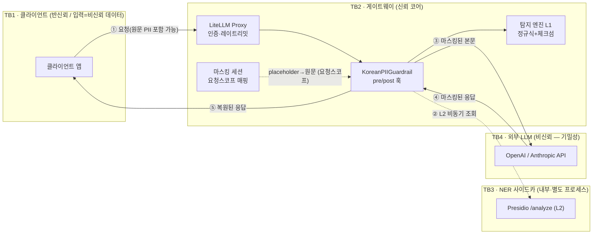

# THREAT_MODEL.md — 한국어 PII LLM 게이트웨이 위협 모델

이 문서는 게이트웨이를 **공격자 관점**에서 분석한다. 무엇을 지키고(자산), 어디서 신뢰가
바뀌며(신뢰 경계), 어떤 공격이 가능하고(위협), 지금 코드의 어떤 경로가 그것을 막으며(완화),
무엇이 아직 안 막히는지(잔여 리스크)를 명시한다.

- **방법론**: [STRIDE](https://learn.microsoft.com/azure/security/develop/threat-modeling-tool-threats) 로 시스템 위협을 분류하고, LLM 특화 위협은 [OWASP LLM Top 10 (2025)](https://owasp.org/www-project-top-10-for-large-language-model-applications/) 및 [MITRE ATLAS](https://atlas.mitre.org/) 와 교차 매핑한다.
- **원칙**: 모든 완화책은 실제 코드 경로(`파일:함수`)에 연결한다. 검증되지 않은 방어는 "잔여 리스크"로 남긴다.
- **한 줄 요약**: 이 시스템은 **아웃바운드 PII 유출(OWASP LLM02) 방어에 특화**된 보안 게이트웨이이며, **프롬프트 인젝션(LLM01)은 휴리스틱 플래깅으로 부분 대응**한다(§7 R2). 인젝션의 완전 방어(의역·간접·의미론적 공격)는 미해결 영역으로 §4·§7에 한계를 명시한다.

---

## 1. 시스템 개요와 신뢰 경계

| 경계 | 사이 | 신뢰 가정 | 넘어가면 안 되는 것 |
|---|---|---|---|
| **TB1** | 클라이언트 ↔ 게이트웨이 | 클라이언트는 인증되지만, **본문은 비신뢰 데이터**(공격자가 내용을 통제) | — |
| **TB2** | 게이트웨이 내부 | 코어는 신뢰. 프로세스 메모리·설정 파일 무결성 가정 | 원문 PII가 로그/메트릭/감사로 새면 안 됨 |
| **TB3** | 게이트웨이 ↔ NER | 내부망. 사이드카는 가용성 낮을 수 있음(별도 프로세스) | 원문이 사이드카 로그에 남으면 안 됨 |
| **TB4** | 게이트웨이 ↔ 외부 LLM | **기밀성 비신뢰** — 프로바이더는 우리 통제 밖에서 로그·보존 | **원문 PII는 이 경계를 절대 넘으면 안 됨(시스템의 존재 이유)** |

---

## 2. 보호 자산 (Assets)

| ID | 자산 | 유출/훼손 시 영향 |
|---|---|---|
| **A1** | 요청 본문의 원문 PII | TB4로 유출 시 제3자에 개인정보 노출 — 시스템 실패의 정의 |
| **A2** | 역매핑 테이블(`placeholder→원문`) | 유출 시 **모든 마스킹이 역산 가능** = 방어 전면 무력화 |
| **A3** | 크리덴셜 — (a)사용자 텍스트 내 키/토큰, (b)게이트웨이의 업스트림 프로바이더 키·`master_key` | 키 유출 시 계정 도용·비용 폭탄 |
| **A4** | 게이트웨이 가용성 | 인라인 구성이라 다운/과지연 시 전체 LLM 트래픽 차단 또는 우회 유발 |
| **A5** | 감사 로그 무결성 | 훼손 시 PII 유출 사고의 추적 불가(규제 대응 실패) |

---

## 3. 행위자와 신뢰 수준 (Actors)

| 행위자 | 신뢰 수준 | 비고 |
|---|---|---|
| 클라이언트 앱 | 반신뢰 | 인증됨. 단 **본문 내용은 비신뢰**(공격자 통제 입력) |
| 게이트웨이 운영자 | 신뢰 | 정책·설정·배포 통제 |
| NER 사이드카 | 반신뢰 | 내부망. 가용성·응답 무결성은 보장 못 함 |
| 외부 LLM 프로바이더 | **기밀성 비신뢰** | 마스킹된 데이터만 봐야 함 |
| 공격자 (외부) | 비신뢰 | 클라이언트 입력을 통제, 탐지 우회 시도 |
| 공격자 (동일 호스트/네트워크) | 비신뢰 | 프로세스 메모리·사이드카·로그 접근 시도 |

---

## 4. 범위 (Scope)

**In scope**
- 아웃바운드 요청에서 한국어 PII·크리덴셜 탐지 및 마스킹/차단 (OWASP **LLM02**)
- 원문 PII의 로그/메트릭/감사/예외로의 유출 방지 (§6 불변식)
- 탐지 실패·NER 장애 시 안전한 실패 동작(fail-closed)
- 응답 경로에서의 마스킹 복원 정합성

**Out of scope (현재)** — 의도적으로 다루지 않으며, 이유와 함께 명시한다:
| 범위 밖 항목 | OWASP/ATLAS | 이유 · 계획 |
|---|---|---|
| 프롬프트 인젝션의 **완전 방어** | LLM01 | 휴리스틱 플래깅은 구현(§7 R2)하되, 의역·간접(RAG/tool)·의미론적 공격의 **완전 차단은 미해결**로 범위 밖 |
| 적대적 회피에 대한 강건성 | ATLAS *Evade ML* | L1/L2는 자연 입력 기준. 적대적 정규화·테스트는 로드맵 R1 |
| 모델 출력의 유해성/환각 | LLM09 | 콘텐츠 안전은 별도 관심사 |
| 프로바이더 인프라 침해 | — | TB4는 기밀성만 비신뢰로 취급(마스킹으로 대응) |
| 네트워크 전송 보안(TLS) | — | 배포 인프라(리버스 프록시/mTLS)가 담당한다고 가정 |

**가정 (Assumptions)**
- LiteLLM Proxy의 인증(`master_key`/virtual key)·레이트리밋이 **설정되어 있다** (게이트웨이 자체는 인증을 하지 않음 — TB2 진입 통제는 LiteLLM 책임).
- 정책 파일(`policies/*.yaml`)과 설정의 파일시스템 무결성은 배포 환경이 보장한다.
- 게이트웨이 프로세스 메모리는 동일 호스트의 비신뢰 프로세스로부터 격리되어 있다.

---

## 5. 위협 분석 (STRIDE × OWASP LLM Top 10)

가능성/영향은 정성 척도(높음·중간·낮음). **완화**는 코드 경로, **잔여**는 §7 등록부 ID로 연결.

### 5.1 Information Disclosure — 핵심 카테고리

| ID | 위협 | 자산 | OWASP | 가능·영향 | 완화 (코드) | 잔여 |
|---|---|---|---|---|---|---|
| **I1** | **탐지 우회로 원문 PII가 TB4로 유출** — 난독화·인코딩·신형식·언어혼용·턴 분할 | A1 | LLM02 | 중간·높음 | L1 정규식+체크섬(`detectors/regex_detectors.py`, `validators.py`) + L2 NER(`engine.scan_async`); **입력 정규화**로 전각·원형숫자·제로폭·소프트하이픈 회피 방어(`normalize.py`); 측정 하니스(`tests/util/eval.py`)·적대적 측정(`tests/util/adversarial.py`) | **R1** |
| **I2** | 원문 PII가 로그/메트릭/예외로 유출 | A1 | LLM02 | 중간·높음 | 감사·메트릭은 카운트/타입/지연만(`audit.py:event_from_result`, `metrics.py:record_scan`); `ProcessResult` 주석 D4; 예외 메시지에 원문 미포함(`kpii_guardrail.py`); 검증 `tests/unit/test_no_leak.py` + 라이브 로그 grep(NOTES) | R7 |
| **I3** | 역매핑(A2) 탈취로 마스킹 역산 | A2 | LLM02 | 낮음·높음 | 매핑은 **요청 스코프**(`MaskingSession.mapping`), `data["metadata"]`에만 저장하고 **싱글턴 guardrail `self`엔 절대 안 올림**(`kpii_guardrail.py:async_pre_call_hook`) — 영속화(DB/Redis/파일/로그) 금지 | R8 |
| **I4** | 교차 요청 매핑 오적용(다른 요청의 PII가 응답에 노출) | A1 | LLM02 | 낮음·높음 | 매핑을 요청별 `metadata`에서만 조회(`_mapping_from`) — 인스턴스 공유 상태 없음(불변식 §6) | — |
| **I5** | 마스킹 후에도 프로바이더가 잔여 문맥·불완전 마스킹 보존 | A1 | LLM02 | 중간·중간 | 차단 대상(RRN/크리덴셜 등)은 마스킹이 아니라 **요청 자체 차단**(`_finalize` block 경로) | R1 |
| **I6** | 스트리밍 청크 경계로 placeholder가 쪼개져 복원 실패 | A1 | LLM05 | 낮음·중간 | 슬라이딩 버퍼 복원(`masking.py:StreamRestorer.push/flush`) — 종료 청크에서 잔여 방출 | R6 |
| **I7** | 관측 측면 채널 — 엔티티별 탐지 카운트로 PII **존재/종류** 추론(값은 아님) | A1 | — | 낮음·낮음 | 메트릭은 타입·수만 노출 | R7(수용) |

### 5.2 Denial of Service

| ID | 위협 | 자산 | OWASP | 가능·영향 | 완화 | 잔여 |
|---|---|---|---|---|---|---|
| **D1** | 악성 입력으로 정규식 백트래킹(ReDoS) → 게이트웨이 행 | A4 | LLM10 | 중간·중간 | 패턴은 **경계 있는 수량자**(`{n,m}`)·단일 문자클래스 위주로 검토(카드 후보 `\d(?:[ \-]?\d){12,18}` 등) | **R4** |
| **D2** | NER 사이드카 과부하 → **degrade(fail-open)면 L1만으로 저하** → 유출 확률↑ | A4→A1 | LLM10 | 중간·높음 | 정책 선택: `ner.on_failure=block`이면 503 차단(`engine.scan_async`, `kpii_guardrail.py`) | **R3** |
| **D3** | 초대형 입력으로 스캔 자원 고갈 | A4 | LLM10 | 중간·중간 | (입력 길이 상한 미구현) | **R4** |

### 5.3 Tampering / Spoofing / Repudiation / Elevation

| ID | STRIDE | 위협 | 자산 | 가능·영향 | 완화 | 잔여 |
|---|---|---|---|---|---|---|
| **T1** | Tampering | 정책 YAML/환경변수 변조로 마스킹 비활성화 | A1 | 낮음·높음 | 배포 시 설정 무결성 가정(§4); 기본정책은 RRN/크리덴셜 block | 배포 통제 |
| **S1** | Spoofing | 인증 미설정 시 오픈 프록시 → 업스트림 키 남용 | A3 | 중간·높음 | LiteLLM `master_key`/virtual key 사용 가정(§4) | 배포 통제 |
| **R1r** | Repudiation | 감사 누락으로 유출 추적 불가 | A5 | 낮음·중간 | 모든 요청에 감사 이벤트(`kpii_guardrail.py:_emit_audit`) | 감사 싱크 보존은 인프라 |
| **E1** | EoP/우회 | **스캔 안 하는 필드**에 PII를 실어 우회 | A1 | 중간·높음 | 주요 필드 커버(`openai_gateway.py:_iter_scan_fields` — messages/tool_calls args/prompt/embeddings) | **R5** |
| **E2** | 내부오류 우회 | 크래시 유발 입력 + `on_internal_error=degrade`(fail-open)로 통과 | A1 | 중간·높음 | 기본 fail-closed 선택 가능(`kpii_guardrail.py` except 절) | **R3** |

---

## 6. 핵심 보안 불변식 (Security Invariants)

코드가 반드시 지켜야 하고, 회귀 시 테스트가 깨져야 하는 규칙:

1. **원문 PII는 로그·예외·메트릭·감사·테스트명에 절대 안 남긴다.** — `audit.py`/`metrics.py`는 값 대신 타입·카운트만. 검증: `tests/unit/test_no_leak.py`, 라이브 로그 grep(NOTES).
2. **역매핑은 요청 스코프 인메모리로만 존재하고, 싱글턴 guardrail 인스턴스(`self`)에 올리지 않는다.** — 요청별 상태는 `data["metadata"]`에. → 교차 요청 격리(I4).
3. **차단 판정 시 본문을 변형하지 않는다.** — `_finalize`는 block 엔티티가 있으면 즉시 blocked 반환(마스킹·전달 없음).
4. **기본은 fail-closed.** — 필터 내부 오류·NER 장애 시 정책에 따라 차단(민감 환경 기본값).
5. **역매핑은 절대 영속화하지 않는다(DB/Redis/파일/로그 금지).**

---

## 7. 잔여 리스크 등록부 (Residual Risk Register)

문서가 곧 로드맵이다. 아직 안 막힌 것과 대응 계획:

| ID | 잔여 리스크 | 심각도 | 현재 상태 | 대응 로드맵 |
|---|---|---|---|---|
| **R1** | 적대적 회피(난독화·인코딩·스크립트 혼용·턴 분할) | 중간 (↓높음) | **부분완화 완료** — 입력 정규화(`normalize.py`: NFKC+보이지않는문자 제거)로 전각·원형숫자·제로폭·소프트하이픈 방어(적대적 하니스 `tests/util/adversarial.py`로 4벡터 12/12 복구 측정). **잔여**: 낱자 공백분리·한글표기("공일공")·base64·스크립트혼용 호모글리프(키릴) | 잔여는 정밀도 리스크가 커 별도 대응 — 신뢰도 임계·L2 NER 강화·(인코딩)디코드 휴리스틱 |
| **R2** | 프롬프트 인젝션/탈옥 | 중간 (↓높음) | **부분완화 완료** — 휴리스틱 탐지 `kpii/injection.py`(카테고리: OVERRIDE·EXFIL·ROLE·SUPPRESS·ENCODING·DELIM, 한/영, 정규화 전처리 재사용). 기본 `log_only`(관측), 정책으로 `block`. 벤치마크 `tests/util/injection_eval.py` 재현율/정밀도 ≈ 0.93/0.93. **잔여**: 의역·신규표현·간접 인젝션·use-vs-mention·타 언어 | 잔여는 임계·룰만으론 한계 — 경량 분류기(fine-tuned) 또는 LLM 심판 도입이 다음 단계 |
| **R3** | degrade/on_internal_error = fail-open | 중간 | 정책으로 선택 가능 | 민감 엔티티(RRN/크리덴셜)는 degrade에서도 **L1 차단 유지**(부분 fail-closed) |
| **R4** | ReDoS·초대형 입력 자원 고갈 | 중간 | 경계 정규식만 | 입력 길이 상한 + 정규식 실행 타임아웃(defense-in-depth) |
| **R5** | 비스캔 필드로 우회(E1) | 중간 | 주요 필드만 커버 | 스캔 대상 확장 + 미지 필드 **deny-by-default** 검토 |
| **R6** | n>1 스트리밍 응답 복원(choices[0]만) | 낮음(정합성) | n=1 가정 | 멀티 choice 복원 |
| **R7** | 관측 측면 채널(엔티티 카운트) | 낮음 | 값 미노출 | 수용(문서화). 필요 시 집계 노이즈 |
| **R8** | 프로세스 메모리 내 매핑 노출 | 낮음 | 요청 스코프·미영속 | 수용(호스트 격리 가정). 조기 파기 검토 |

---

## 8. 참고 프레임워크
- **STRIDE** — 시스템 위협 분류
- **OWASP Top 10 for LLM Applications (2025)** — LLM02(민감정보 노출, 핵심), LLM01(프롬프트 인젝션, 범위 밖), LLM05(부적절한 출력 처리), LLM10(무제한 소비)
- **MITRE ATLAS** — 적대적 회피(*Evade ML Model*) 관점의 R1

> 이 문서는 살아있는 문서다. 코드가 바뀌면 해당 완화 경로와 잔여 리스크를 함께 갱신한다.
